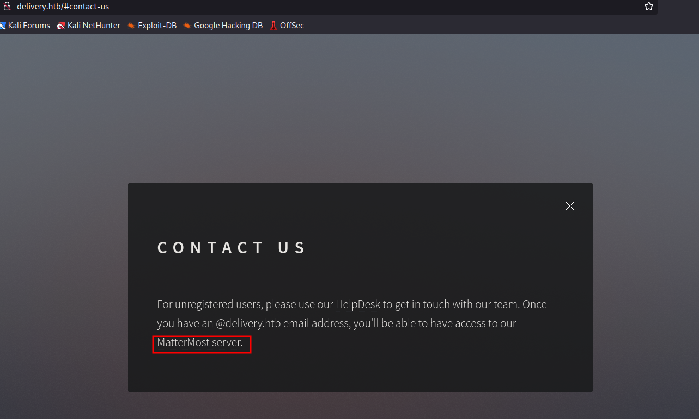

# Delivery - HackTheBox


## 1. Enumeration

### Nmap initial scan

```
# Nmap 7.92 scan initiated Wed Jul  6 01:04:41 2022 as: nmap -sC -sV -oN nmap_init 10.10.10.222
Nmap scan report for 10.10.10.222
Host is up (0.27s latency).
Not shown: 998 closed tcp ports (reset)
PORT   STATE SERVICE VERSION
22/tcp open  ssh     OpenSSH 7.9p1 Debian 10+deb10u2 (protocol 2.0)
| ssh-hostkey: 
|   2048 9c:40:fa:85:9b:01:ac:ac:0e:bc:0c:19:51:8a:ee:27 (RSA)
|   256 5a:0c:c0:3b:9b:76:55:2e:6e:c4:f4:b9:5d:76:17:09 (ECDSA)
|_  256 b7:9d:f7:48:9d:a2:f2:76:30:fd:42:d3:35:3a:80:8c (ED25519)
80/tcp open  http    nginx 1.14.2
|_http-server-header: nginx/1.14.2
|_http-title: Welcome
Service Info: OS: Linux; CPE: cpe:/o:linux:linux_kernel

Service detection performed. Please report any incorrect results at https://nmap.org/submit/ .
# Nmap done at Wed Jul  6 01:05:00 2022 -- 1 IP address (1 host up) scanned in 18.43 seconds

```


### Nmap full port scan

```
# Nmap 7.92 scan initiated Wed Jul 20 02:15:19 2022 as: nmap -p- -oN nmap_allport -v 10.10.10.222
Nmap scan report for delivery.htb (10.10.10.222)
Host is up (0.27s latency).
Not shown: 65532 closed tcp ports (reset)
PORT     STATE SERVICE
22/tcp   open  ssh
80/tcp   open  http
8065/tcp open  unknown

Read data files from: /usr/bin/../share/nmap
# Nmap done at Wed Jul 20 02:28:07 2022 -- 1 IP address (1 host up) scanned in 768.50 seconds
                                                                                               
```


Found hostname *delivery.htb* and *helpdesk.delivery.htb* and saved it into /etc/hosts.



By clicking on the link in contact us page, it was redirected into a login portal.


Moving on to *helpdesk.delivery.htb*,  there are options to create a new ticket and to check the ticket status. So i opened a new ticket by filling out the details.


Got a response saying that i can check status of the ticket by ticket id (4933109@delivery.htb).


After logging in, the ticket information can be viewed. 


Moving on to the mattermost page, i can create a new account. So i created an account using the mail provided by the support team. As there is a broken authentication, i was able to create the account.  


click create new one


registration successful !


To activate, run the url.


After login we can see an internal channel.


From the channel i got the credentials to a user account.

maildeliverer:Youve_G0t_Mail!

Using these credentials, i logged into ssh.


After checking the /etc/passwd, there is another user named mattermost. We need to find the password for that.


From this, there is a hint that may be a bruteforce attack might work. So using hashcat we define rules to create wordlist for PleaseSubscribe!.

By checking config.json file in /opt/mattermost directory, got credentials to database.

From there found mattermost table and got root's hash from users table.

Used johntheripper to crack the hash using wordlist created above.

password found successfully and got root flag.


